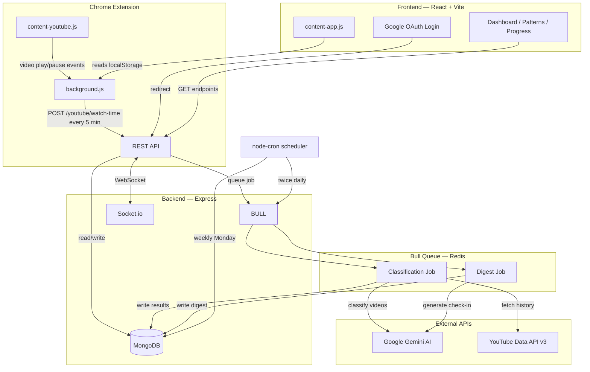

<div align="center">

<br />

# SCROLLSENSE

### Know what you watch. Own how you feel.

<br />

[](https://react.dev/)
[](https://nodejs.org/)
[](https://expressjs.com/)
[](https://www.mongodb.com/)
[](https://socket.io/)
[](https://redis.io/)
[](https://tailwindcss.com/)
[](https://vite.dev/)
[](https://ai.google.dev/)
[](https://developer.chrome.com/docs/extensions/mv3/)

<br />

**A full-stack behavioral awareness platform that classifies your YouTube watch history using Gemini AI, tracks real watch time via a Chrome extension, and helps you align your feed with your career goals — without blocking, without guilt, without streaks.**

<br />

[Live Demo](https://scroll-sense-alpha.vercel.app/) &nbsp;&middot;&nbsp; [Getting Started](#getting-started) &nbsp;&middot;&nbsp; [API Docs](#api-reference) &nbsp;&middot;&nbsp; [Architecture](#system-architecture)

<br />

</div>

---

## Table of Contents

- [Why ScrollSense](#why-scrollsense)
- [Features](#features)
- [Tech Stack](#tech-stack)
- [System Architecture](#system-architecture)
- [Privacy Architecture](#privacy-architecture)
- [Getting Started](#getting-started)
- [Environment Variables](#environment-variables)
- [Database Schema](#database-schema)
- [Chrome Extension](#chrome-extension)
- [Deployment](#deployment)
- [API Reference](#api-reference)
- [Project Structure](#project-structure)
- [Contributing](#contributing)
- [License](#license)

---

## Why ScrollSense

Most screen-time tools treat you like an addict — blocking apps, enforcing streaks, guilt-tripping you when you break. ScrollSense takes a fundamentally different approach: **awareness, not restriction.**

> _"This page only shows forward movement. No streaks. No resets. One bad week is one data point — not a failure."_
>
> — Progress page, built into the product

ScrollSense is built for students — particularly CS students preparing for placements — who want to understand where their scroll time actually goes, see how their feed aligns with their career goals, and reclaim time they didn't know they were losing.

**Core principles, enforced in code:**

| Principle | Implementation |
|---|---|
| **No blocking** | You're an adult. We show you data and let you decide. |
| **No streaks** | One bad week is one data point — not a failure. No streak counter exists in the codebase. |
| **No guilt** | Interest content (gaming, cricket, music) is budgeted with daily minute limits you set — not banned. |
| **No assumptions** | Every insight is built from your actual watch history, classified by Gemini AI against your declared goals. |
| **Privacy by architecture** | Video titles are never stored. Instagram data never leaves the browser. Chat messages have no user ID. |

---

## Features

### Dashboard

- **Content Diet Dashboard** — Stacked bar chart of weekly YouTube consumption broken down by `goal` (career-relevant), `interest` (budgeted leisure), and `junk` (neither). Powered by Gemini AI classification of actual watch history.
- **Goal Relevance Score** — Weekly score (0-100) representing how much of your consumption aligned with your declared career path and goals. Tracks history across weeks.
- **Interest Budget Tracker** — Real-time daily consumption per declared interest (e.g., cricket, gaming, music) against your self-set daily minute budgets from `BehaviorDay` records.
- **Daily Intention Banner** — Set a daily intention category before scrolling. One per day, frames that day's sessions.
- **Session Logger** — Log scroll sessions with platform, duration, intention category, and mood rating (1-5). Dashboard card + floating action button.
- **Craving Log** — Log cravings with category and outcome (resisted/succumbed). Feeds into trigger detection and habit nudges.
- **Weekly Check-in** — AI-generated weekly reflection with behavior changes, content diet shifts, and insights. Generated via Bull queue + Gemini.
- **Habit Nudge Engine `F14`** — Personalized behavioral nudges based on content diet, goal score trends, craving patterns, and peak scroll hours. Supports feedback.

### Patterns

- **Trigger Pattern Detector `F7`** — Analyzes sessions, intentions, and daily behavior to identify when and why you scroll — peak hours, dominant triggers, platform preferences.
- **Echo Chamber Score `F8`** — Content diversity score (0-100) based on YouTube channel variety and Instagram topics. Higher = more diverse feed.
- **Cross-Platform Map `F11`** — YouTube and Instagram usage side by side. Instagram data is processed entirely client-side. Shows per-platform minutes, interest breakdowns, combined insights.
- **Habit Nudge Engine `F14`** — Also rendered on Patterns page with full trigger/nudge context.

### Progress

- **Time Refund Tracker `F9`** — Total minutes reclaimed vs baseline. Progress toward milestones (1h, 5h, etc.) with visual tracker.
- **Behavioral Trend Graph `F15`** — Weekly scroll minutes, content diet %, and mood trends over time. Incorporates craving data.

### Community

- **Anonymous Accountability Groups** — 18 pre-seeded groups by trigger type (late night, stress, boredom, procrastination, morning habit, general). Max 8 members each.
- **Anonymous Identity** — Auto-generated names (e.g., "Quiet Falcon 7"). No real names or user IDs in chat messages.
- **Weekly Submission** — Submit weekly scroll delta to your group. Tracks submission streaks and detects milestones.
- **Real-Time Group Chat** — Socket.io-powered anonymous chat with typing indicators, online presence, reactions (`fire`, `clap`, `heart`, `strong`), FIFO cleanup (200 msgs/group).
- **Group Recommendations** — Algorithm-based matching using craving patterns, peak hours, and intention categories.
- **Group Feed** — Weekly submission history and performance trends.

### Settings

- **Privacy Education** — Human-readable explanation of what ScrollSense stores, discards, and what never leaves the browser.
- **Instagram Data Guide** — Step-by-step instructions for uploading Instagram data export. Processed client-side; only aggregated counts sent to backend.
- **Data Vault** — Inventory of stored data + explicit list of what is *not* stored.
- **Account Settings** — Update daily limit, goals, career path, interests.
- **Notification Settings** — Configure digest and community notification preferences.
- **Delete Account** — Permanent deletion of all data across all 10 collections.

---

## Tech Stack

### Frontend

| Package | Role in ScrollSense |
|---|---|
| `react` 19 | UI framework with lazy-loaded route-based code splitting |
| `react-router-dom` 7 | Client-side routing with protected routes |
| `zustand` | Lightweight state management (auth store, dashboard store) |
| `@tanstack/react-query` | Server state, caching, background refetching |
| `axios` | HTTP client with interceptors for silent JWT refresh |
| `socket.io-client` | Real-time community chat |
| `framer-motion` | Page transitions and component animations |
| `recharts` | Charts — content diet, trends, progress |
| `tailwindcss` | Utility-first styling with custom tokens (Space Grotesk, #DFE104 accent, zero border-radius) |
| `lucide-react` | Icon library |
| `lenis` | Smooth scroll |
| `vite` | Build tool and dev server (port 5173) |
| `vitest` | Unit testing |

### Backend

| Package | Role in ScrollSense |
|---|---|
| `express` | HTTP server and REST API |
| `mongoose` | MongoDB ODM — 12 model schemas |
| `passport` + `passport-google-oauth20` | Google OAuth 2.0 with YouTube read-only scope |
| `jsonwebtoken` + `bcryptjs` | JWT access/refresh tokens, password & token hashing |
| `bull` | Redis-backed job queue — classification and digest |
| `socket.io` | Real-time WebSocket server for group chat + presence |
| `@google/generative-ai` | Gemini API — video classification + weekly check-in |
| `googleapis` | YouTube Data API v3 — watch history + video metadata |
| `helmet` | HTTP security headers |
| `cors` | CORS with browser extension origin support |
| `express-rate-limit` | Auth route rate limiting |
| `crypto-js` | AES encryption for stored OAuth tokens |
| `node-cron` | Scheduled tasks (YouTube sync, community aggregation) |
| `nodemailer` | Weekly digest email delivery |
| `@aws-sdk/client-s3` | Instagram export temp storage |

### Chrome Extension (Manifest V3)

| File | Role |
|---|---|
| `background.js` | Service worker — accumulates watch-time, flushes to backend every 5 min via `chrome.alarms` |
| `content-youtube.js` | Tracks actual seconds per video via HTML5 `<video>` play/pause/ended events |
| `content-app.js` | Reads auth credentials from ScrollSense frontend `localStorage`, bridges to service worker |
| `popup.html` / `popup.js` | Status display — connection state, pending reports, manual flush button |

---

## System Architecture

### Data Flow



### Gemini Classification Pipeline

1. Classification job receives a user ID and fetches YouTube watch history via YouTube Data API v3 using stored OAuth tokens
2. Videos are deduplicated against `ClassifiedVideo` collection (cache hit = skip Gemini call)
3. New videos are batched and sent to Gemini with a prompt containing the user's career path, goals, and declared interests with keyword hints
4. Gemini returns a classification per video: `goal` (career-relevant), `interest` (budgeted leisure), or `junk` (neither)
5. If the extension reported actual watch time for a video, those seconds are used; otherwise falls back to YouTube API duration (capped proportionally)
6. Results aggregated into `BehaviorWeek` (weekly totals, percentages, peak hour) and `BehaviorDay` (daily breakdowns per platform/interest)
7. `QuotaDailyExhaustedError` sentinel saves partial results when Gemini daily quota is hit

### Cron Jobs

| Schedule | Job | Description |
|---|---|---|
| Twice daily (6 AM / 6 PM UTC) | `syncAllEligibleUsers` | Queues classification jobs for users who haven't synced in 6+ hours |
| Every Monday 00:05 UTC | `aggregateCommunityWeek` | Updates group submission streaks and aggregates weekly performance |

### Instagram Processing

Instagram data is processed **entirely client-side**. Users upload their data export in the browser. The frontend parses it and sends only aggregated topic counts and minute totals to the backend — no URLs, no post content, no creator names ever leave the browser.

### Real-Time Chat

Socket.io with JWT auth middleware. Events: `send_message`, `typing_start/stop`, `add/remove_reaction`, `load_more_messages`, presence tracking. Messages stored without `userId` — only anonymous name. FIFO cleanup caps each group at 200 messages.

---

## Privacy Architecture

Privacy is not a feature — it's the architecture. Every data model was designed with explicit decisions about what to store and what to discard.

### What Is Stored

| Data | Collection | Purpose |
|---|---|---|
| YouTube video IDs | `ClassifiedVideo` | Cache classification results, avoid re-classifying |
| Classification labels (goal / interest / junk) | `ClassifiedVideo` | Core insight data |
| Watched seconds per video per day | `VideoWatchTime` | Accurate minute calculations (from extension) |
| Aggregated weekly/daily metrics | `BehaviorWeek`, `BehaviorDay` | Dashboard and trend visualizations |
| Self-logged sessions, intentions, cravings | `Session`, `Intention`, `Craving` | User-initiated tracking |
| Anonymous chat messages | `GroupMessage` | Community — stored with anonymous name only |
| Instagram aggregated topic counts | `BehaviorDay` | Cross-platform insights |

### What Is Never Stored

| Data | Reason |
|---|---|
| **YouTube video titles** | Explicitly excluded — comment in model: _"We never store video titles"_ |
| **Instagram post URLs** | Processed client-side only; aggregated counts sent to backend |
| **Instagram creator usernames** | Never transmitted to backend |
| **User ID in chat messages** | `GroupMessage` schema omits `userId` — comment: _"We do NOT store userId for privacy"_ |
| **Real names in community** | Members get auto-generated anonymous names |
| **Raw OAuth tokens** | Encrypted with `crypto-js` AES before storage |

### What Never Leaves the Browser

- Raw Instagram export file contents
- Instagram post media and URLs
- Video titles (extension only sends video IDs + seconds watched)

---

## Getting Started

### Prerequisites

- **Node.js** >= 18.0.0
- **MongoDB** (local or [MongoDB Atlas](https://cloud.mongodb.com/))
- **Redis** (local or [Upstash](https://upstash.com/))
- **Google Cloud Console** project with OAuth 2.0 credentials + YouTube Data API v3 enabled
- **Google AI Studio** API key for Gemini

### 1. Clone

```bash
git clone https://github.com/your-username/ScrollSense.git
cd ScrollSense
```

### 2. Backend

```bash
cd scrollsense-backend
npm install
cp .env.example .env
# Fill in all required env vars — see Environment Variables section
npm run seed:groups    # Creates 18 accountability groups
npm run dev            # Starts with nodemon on port 5000
```

### 3. Frontend

```bash
cd scrollsense
npm install
cp .env.example .env
# Fill in frontend env vars
npm run dev            # Starts on port 5173
```

### 4. Chrome Extension

1. Go to `chrome://extensions/`
2. Enable **Developer mode**
3. Click **Load unpacked** and select the `scrollsense-extension/` folder
4. Log in to ScrollSense — extension auto-links via `localStorage` bridge

See [Chrome Extension](#chrome-extension) for full details.

---

## Environment Variables

### Backend (`scrollsense-backend/.env`)

| Variable | What It Is | Where To Get It | Required |
|---|---|---|---|
| `PORT` | Server port | Default: `5000` | Yes |
| `NODE_ENV` | Environment mode | `development` / `production` | Yes |
| `FRONTEND_URL` | Frontend origin for CORS | `http://localhost:5173` | Yes |
| `MONGODB_URI` | MongoDB connection string | [MongoDB Atlas](https://cloud.mongodb.com/) or local | Yes |
| `GOOGLE_CLIENT_ID` | Google OAuth client ID | [Google Cloud Console](https://console.cloud.google.com/) | Yes |
| `GOOGLE_CLIENT_SECRET` | Google OAuth client secret | Same as above | Yes |
| `GOOGLE_CALLBACK_URL` | OAuth redirect URI | `http://localhost:5000/api/auth/google/callback` | Yes |
| `JWT_ACCESS_SECRET` | Access token signing secret | `openssl rand -hex 64` | Yes |
| `JWT_REFRESH_SECRET` | Refresh token signing secret | `openssl rand -hex 64` | Yes |
| `JWT_ACCESS_EXPIRES` | Access token TTL | Default: `15m` | No |
| `JWT_REFRESH_EXPIRES` | Refresh token TTL | Default: `7d` | No |
| `GEMINI_API_KEY` | Google Gemini API key | [Google AI Studio](https://aistudio.google.com/apikey) | Yes |
| `YOUTUBE_API_KEY` | YouTube Data API v3 key | Google Cloud Console | Yes |
| `REDIS_URL` | Redis connection URL | [Upstash](https://upstash.com/) or local | Yes |
| `AWS_ACCESS_KEY_ID` | AWS IAM access key | [AWS IAM](https://console.aws.amazon.com/iam/) | No |
| `AWS_SECRET_ACCESS_KEY` | AWS IAM secret key | Same as above | No |
| `AWS_REGION` | S3 region | e.g., `ap-south-1` | No |
| `AWS_S3_BUCKET` | S3 bucket for Instagram temp storage | AWS S3 Console | No |
| `SMTP_HOST` | Email SMTP host | e.g., `smtp.gmail.com` | No |
| `SMTP_PORT` | Email SMTP port | e.g., `587` | No |
| `SMTP_USER` | SMTP username | Your email | No |
| `SMTP_PASS` | SMTP app password | Gmail App Passwords | No |
| `DIGEST_FROM_EMAIL` | Digest sender address | Any valid email | No |

> **Note:** The `.env.example` lists `OPENAI_API_KEY` but the codebase uses `GEMINI_API_KEY` via `@google/generative-ai`. Use `GEMINI_API_KEY`.

### Frontend (`scrollsense/.env`)

| Variable | What It Is | Where To Get It | Required |
|---|---|---|---|
| `VITE_API_URL` | Backend API base URL | `http://localhost:5000/api` | Yes |
| `VITE_GOOGLE_CLIENT_ID` | Google OAuth client ID | Google Cloud Console | Yes |
| `VITE_APP_NAME` | Application display name | `ScrollSense` | No |
| `VITE_APP_URL` | Frontend URL | `http://localhost:5173` | No |

---

<details>
<summary><strong>Database Schema</strong></summary>

<br />

| Collection | Purpose | Key Fields |
|---|---|---|
| **User** | Identity, auth, preferences | Google ID, email, encrypted OAuth tokens, onboarding status, platforms, career path, goals, interests (with daily minute budgets), scroll triggers, daily limit, YouTube/Instagram connection status, notification prefs. Has `toSafeObject()` to strip sensitive fields. |
| **BehaviorWeek** | Weekly aggregated behavior (1 doc per user per ISO week) | Total scroll minutes, goal/interest/junk %, peak hour, dominant category, trigger patterns, avg mood, interest breakdown, digest sent flag |
| **BehaviorDay** | Daily behavior (1 doc per user per date) | Total/YouTube/Instagram minutes, per-interest breakdowns per platform, daily limit, peak hour, processing flags |
| **ClassifiedVideo** | Cached Gemini classification (1 doc per user per video) | Video ID, category (`goal`/`interest`/`junk`), matched interest, model used. **Video titles never stored.** |
| **VideoWatchTime** | Extension-reported watch time (1 doc per user per video per day) | Video ID, date, watched seconds (capped at 7200s). Exists because YouTube API doesn't expose per-user watch time. |
| **Session** | Self-logged scroll sessions | Platform, start time, duration, intention category, mood rating (1-5), notes |
| **Intention** | Daily intention (1 per user per day) | Intention category, date |
| **Craving** | Logged cravings | Category, outcome (resisted/succumbed), timestamp |
| **Group** | Pre-seeded accountability groups (6 types x 3 = 18) | Name, trigger type, description, icon, max members (8), open status |
| **GroupMembership** | User-to-group link | Anonymous name, join/leave dates, active status, submission streak. Unique index: one active membership per user. |
| **GroupMessage** | Anonymous chat messages | Anonymous name, content, type (user/system/milestone), reactions, soft-delete. **No userId stored.** |
| **GroupSubmission** | Weekly group progress submissions | Delta minutes, percent change, baseline, sessions count, ISO week |

</details>

---

## Chrome Extension

The extension tracks actual YouTube watch time by listening to HTML5 `<video>` element events. It handles YouTube's SPA navigation, filters out ad time, and flushes data to the backend every 5 minutes.

### Installation

1. Navigate to `chrome://extensions/`
2. Enable **Developer mode** (top-right toggle)
3. Click **Load unpacked**
4. Select the `scrollsense-extension/` folder

### How It Links

The extension auto-links when you visit the ScrollSense frontend:

1. Log in to ScrollSense in your browser
2. `App.jsx` writes your access token + API URL to `localStorage` as `ss_ext_credentials`
3. `content-app.js` (runs on ScrollSense pages, detected via `<meta name="scrollsense-app">` tag in `index.html`) reads this and forwards it to the background service worker
4. Extension popup shows **Connected** with a green indicator

Re-syncs on: page focus, tab switches, token refreshes, cross-tab `storage` events. Auto-clears on 401 response.

### How Watch Tracking Works

- `content-youtube.js` attaches to `<video>` element on every `youtube.com` page
- Listens to `play`, `pause`, `ended`, `seeking`, `seeked` events
- Tracks milliseconds of actual watching (excludes ads via `.ad-showing` class check)
- Reports to `background.js` every 60 seconds via `chrome.runtime.sendMessage`
- Sessions under 5 seconds ignored (accidental clicks)
- `background.js` accumulates in `chrome.storage.local` as `pending_watches` (key: `YYYY-MM-DD|videoId`)
- Flushes to `POST /api/youtube/watch-time` every 5 min via `chrome.alarms`
- On tab close: writes directly to `chrome.storage.local` (more reliable than messaging during teardown)
- Watch time capped at 7,200 seconds (2 hours) per video per day

---

## Deployment

### Frontend — Vercel

The frontend includes `vercel.json` with SPA rewrites:

```json
{
  "rewrites": [
    { "source": "/(.*)", "destination": "/index.html" }
  ]
}
```

1. Connect the `scrollsense/` directory to a Vercel project
2. Set **Root Directory** to `scrollsense`
3. Framework Preset: **Vite**
4. Add environment variables: `VITE_API_URL`, `VITE_GOOGLE_CLIENT_ID`, `VITE_APP_NAME`, `VITE_APP_URL`
5. Deploy

### Backend — Railway

1. Connect `scrollsense-backend/` to a Railway project
2. Start Command: `npm start` (runs `node src/server.js`)
3. Add all required environment variables from the backend table
4. Set `FRONTEND_URL` to your Vercel deployment URL
5. Update `GOOGLE_CALLBACK_URL` to match Railway URL
6. Provision Redis add-on or use Upstash — set `REDIS_URL`

---

<details>
<summary><strong>API Reference</strong></summary>

<br />

### Authentication — `/api/auth`

| Method | Path | Auth | Description |
|---|---|---|---|
| `GET` | `/auth/google` | No | Initiates Google OAuth (scopes: profile, email, YouTube read-only) |
| `GET` | `/auth/google/callback` | No | OAuth callback — issues JWT tokens, redirects to frontend |
| `POST` | `/auth/register` | No | Email/password registration |
| `POST` | `/auth/login` | No | Email/password login |
| `POST` | `/auth/refresh` | Cookie | Refresh access token via httpOnly cookie |
| `POST` | `/auth/logout` | Yes | Clear refresh token and cookie |
| `GET` | `/auth/me` | Yes | Get authenticated user |

### Onboarding — `/api/onboarding`

| Method | Path | Auth | Description |
|---|---|---|---|
| `POST` | `/onboarding` | Yes | Complete onboarding (platforms, career path, goals, interests, triggers, daily limit) |

### User — `/api/user`

| Method | Path | Auth | Description |
|---|---|---|---|
| `GET` | `/user/me` | Yes | Get profile |
| `PUT` | `/user/interests` | Yes | Update interests |
| `GET` | `/user/settings` | Yes | Get settings |
| `PUT` | `/user/settings` | Yes | Update settings |
| `PUT` | `/user/notifications` | Yes | Update notification preferences |
| `GET` | `/user/data-vault` | Yes | Data vault summary |
| `DELETE` | `/user/instagram-data` | Yes | Delete Instagram data |
| `DELETE` | `/user/account` | Yes | Permanently delete account + all data |

### YouTube — `/api/youtube`

| Method | Path | Auth | Description |
|---|---|---|---|
| `POST` | `/youtube/connect` | Yes | Connect YouTube + queue initial classification |
| `GET` | `/youtube/status` | Yes | Connection status, classification progress, freshness |
| `POST` | `/youtube/sync` | Yes | Manual re-sync |
| `POST` | `/youtube/disconnect` | Yes | Disconnect + clear tokens |
| `POST` | `/youtube/watch-time` | Yes | Receive extension watch-time reports (special CORS) |

### Insights — `/api/insights`

| Method | Path | Auth | Description |
|---|---|---|---|
| `GET` | `/insights/dashboard` | Yes | Main dashboard payload |
| `GET` | `/insights/interest-budgets` | Yes | Live daily consumption vs budgets |

### Sessions — `/api/sessions`

| Method | Path | Auth | Description |
|---|---|---|---|
| `POST` | `/sessions/intention` | Yes | Log daily intention |
| `POST` | `/sessions/log` | Yes | Log a session |
| `GET` | `/sessions/today` | Yes | Today's sessions + intention |
| `GET` | `/sessions/stats` | Yes | Weekly + all-time stats |

### Cravings — `/api/cravings`

| Method | Path | Auth | Description |
|---|---|---|---|
| `POST` | `/cravings` | Yes | Log craving |
| `GET` | `/cravings/recent` | Yes | Recent cravings |
| `GET` | `/cravings/stats` | Yes | Craving statistics |

### Daily — `/api/daily`

| Method | Path | Auth | Description |
|---|---|---|---|
| `GET` | `/daily/week` | Yes | Daily behavior for current week |

### Digest — `/api/digest`

| Method | Path | Auth | Description |
|---|---|---|---|
| `GET` | `/digest/checkin` | Yes | Full weekly check-in (may trigger Gemini) |
| `GET` | `/digest/status` | Yes | Check-in availability status |

### Patterns — `/api/patterns`

| Method | Path | Auth | Description |
|---|---|---|---|
| `GET` | `/patterns/trigger-detector` | Yes | Trigger pattern analysis `F7` |
| `GET` | `/patterns/echo-chamber` | Yes | Echo chamber score `F8` |
| `POST` | `/patterns/instagram-upload` | Yes | Upload client-side processed Instagram data `F11` |
| `DELETE` | `/patterns/delete-instagram` | Yes | Delete Instagram data + recalculate |
| `GET` | `/patterns/cross-platform` | Yes | Cross-platform comparison `F11` |
| `GET` | `/patterns/habit-nudge` | Yes | Personalized nudge `F14` |
| `POST` | `/patterns/habit-nudge/feedback` | Yes | Nudge feedback |

### Progress — `/api/progress`

| Method | Path | Auth | Description |
|---|---|---|---|
| `GET` | `/progress/time-refund` | Yes | Time reclaimed + milestones `F9` |
| `GET` | `/progress/trends` | Yes | Behavioral trends `F15` |

### Community — `/api/community`

| Method | Path | Auth | Description |
|---|---|---|---|
| `GET` | `/community/my-group` | Yes | Current group details, members, submissions, messages |
| `GET` | `/community/groups` | Yes | All open groups with member counts |
| `GET` | `/community/recommendations` | Yes | Algorithm-based group recommendations |
| `POST` | `/community/join/:groupId` | Yes | Join group (auto-assigns anonymous name) |
| `POST` | `/community/submit-week` | Yes | Submit weekly scroll delta |
| `POST` | `/community/leave` | Yes | Leave current group |
| `POST` | `/community/request-new-group` | Yes | Leave + get fresh recommendations |
| `GET` | `/community/messages/:groupId` | Yes | Paginated group chat messages |
| `POST` | `/community/messages/:groupId` | Yes | Send chat message |
| `DELETE` | `/community/messages/:messageId` | Yes | Soft-delete own message |
| `POST` | `/community/react/:messageId` | Yes | Add/remove reaction |

### Socket.io Events

| Event | Direction | Description |
|---|---|---|
| `connected` | Server > Client | Connection confirmed with group ID, anonymous name, online members |
| `no_group` | Server > Client | User has no active group |
| `initial_messages` | Server > Client | Last 50 messages on connect |
| `send_message` | Client > Server | Send chat message |
| `new_message` | Server > Client | Broadcast new message |
| `message_sent` | Server > Client | Send confirmation |
| `message_deleted` | Server > Client | Broadcast deletion |
| `typing_start` / `typing_stop` | Client > Server | Typing indicators |
| `member_typing` / `member_stopped_typing` | Server > Client | Typing broadcasts |
| `add_reaction` / `remove_reaction` | Client > Server | Reaction toggling |
| `reaction_updated` | Server > Client | Broadcast updated counts |
| `member_online` / `member_offline` | Server > Client | Presence tracking |
| `load_more_messages` | Client > Server | Pagination request |
| `messages_loaded` | Server > Client | Older messages response |
| `join_group_room` | Client > Server | Join room after HTTP join |
| `rate_limited` | Server > Client | Rate limit exceeded |
| `error` | Server > Client | Error notification |

</details>

---

## Project Structure

```
ScrollSense/
├── scrollsense/                        # Frontend (React + Vite)
│   ├── public/
│   ├── src/
│   │   ├── api/                        # API service modules
│   │   ├── components/
│   │   │   ├── community/              # GroupChat, GroupFinder, MyGroup, WeeklySubmission, etc.
│   │   │   ├── dashboard/              # ContentDiet, CravingLog, GoalRelevance, InterestBudget, etc.
│   │   │   ├── landing/                # Hero, Features, HowItWorks, Privacy, Comparison, etc.
│   │   │   ├── onboarding/             # 9-step onboarding flow (Platforms > DailyLimit)
│   │   │   ├── patterns/               # TriggerDetector, EchoChamber, CrossPlatform, HabitNudge
│   │   │   ├── progress/               # TimeRefundTracker, BehavioralTrendGraph
│   │   │   ├── settings/               # DataVault, DeleteAccount, PrivacyEducation, etc.
│   │   │   └── shared/                 # ProtectedRoute
│   │   ├── hooks/                      # 10 custom hooks (useYouTubeData, useCommunitySocket, etc.)
│   │   ├── lib/                        # axios (with JWT interceptors), lenis
│   │   ├── pages/                      # 11 pages (Dashboard, Patterns, Progress, Community, etc.)
│   │   ├── store/                      # authStore, dashboardStore (Zustand)
│   │   ├── constants/
│   │   ├── App.jsx
│   │   └── main.jsx
│   ├── index.html                      # Contains <meta name="scrollsense-app"> for extension
│   ├── vercel.json
│   ├── vite.config.js
│   ├── tailwind.config.js
│   └── package.json
│
├── scrollsense-backend/                # Backend (Express + MongoDB)
│   ├── scripts/                        # Debug and test scripts (YouTube, Gemini, Redis)
│   ├── src/
│   │   ├── config/                     # db, env validation, passport, Bull queues, socket.io
│   │   ├── controllers/                # 12 controllers (auth, insights, patterns, community, etc.)
│   │   ├── jobs/                       # classification.job, digest.job, scheduler (cron)
│   │   ├── middleware/                 # JWT auth, socket auth, error handler
│   │   ├── models/                     # 12 Mongoose models
│   │   ├── routes/                     # 12 route files
│   │   ├── scripts/                    # seedGroups, resetYoutubeState
│   │   ├── services/                   # 8 service modules (classification, community, etc.)
│   │   ├── sockets/                    # community.socket.js (all real-time event handlers)
│   │   ├── utils/                      # asyncHandler, dateUtils, encrypt, jwt, validate
│   │   ├── app.js                      # Express config, middleware, route mounting
│   │   └── server.js                   # Entry point — DB, passport, socket.io, cron, queues
│   └── package.json
│
├── scrollsense-extension/              # Chrome Extension (Manifest V3)
│   ├── background.js                   # Service worker — accumulate + flush watch time
│   ├── content-youtube.js              # YouTube video tracking
│   ├── content-app.js                  # Auth credential bridge
│   ├── manifest.json
│   ├── popup.html / popup.js           # Extension popup UI
│   └── README.md
│
└── README.md
```

---

## Contributing

1. Fork the repository
2. Create a feature branch: `git checkout -b feature/your-feature`
3. Commit changes: `git commit -m "Add your feature"`
4. Push: `git push origin feature/your-feature`
5. Open a Pull Request

**Guidelines:**
- Follow existing code style (JavaScript, JSX for React, no TypeScript)
- New API endpoints must include auth middleware where appropriate
- **Privacy principles are non-negotiable** — do not store video titles, real identities in chat, or raw Instagram content
- Test locally with frontend + backend + extension running

---

## License

This project is open source. See the repository for license details.

---

<div align="center">

<br />

**Built by [Jeet Darji](https://github.com/your-username)**

_ScrollSense — because awareness changes behavior, guilt doesn't._

<br />

</div>
